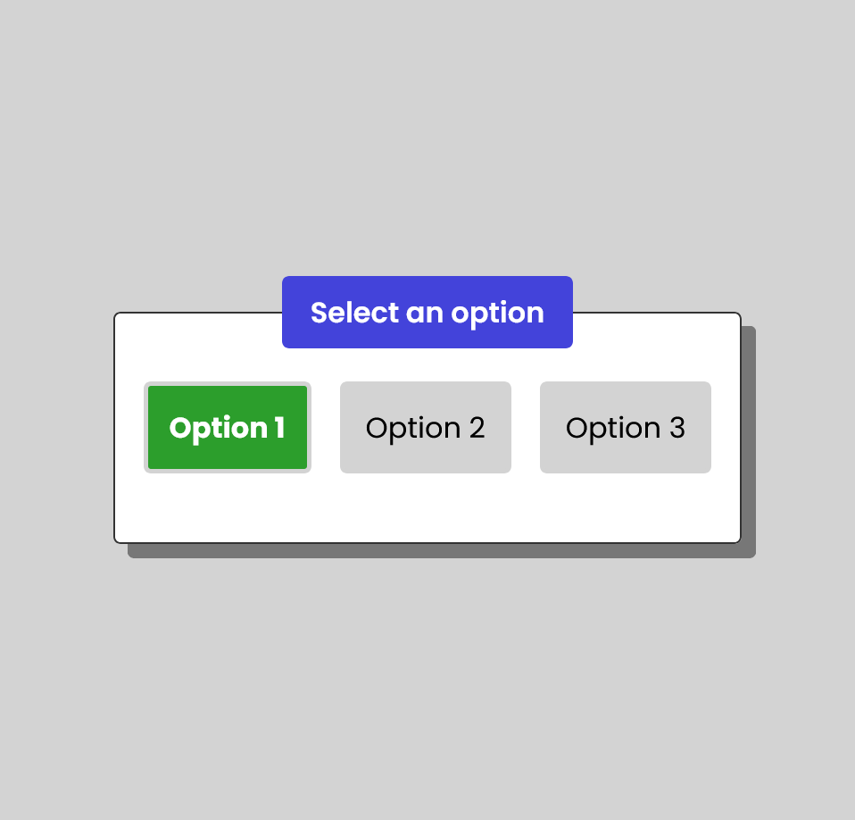

 ## Table of contents

- [Overview](#overview)
  - [The challenge](#the-challenge)
  - [Screenshot](#screenshot)
  - [Links](#links)
- [My process](#my-process)
  - [Built with](#built-with)
  - [What I learned](#what-i-learned)
  - [Continued development](#continued-development)
  - [Useful resources](#useful-resources)
- [Author](#author)
- [Acknowledgments](#acknowledgments)


### Overview

**Project Prompt: RadioButtonGroup Component**

**Task:**
Your task is to create a reusable `RadioButtonGroup` component using React. The component should allow users to select a single option from a list of radio button options.

**Getting started**

Install dependencies via `npm`:
```sh
npm install
```
This requires having node.js installed on your computer. You will need to install node.js if you don't already have it.

**Run the project**
```sh
npm start
```

**Running the unit tests**

```sh
npm run test
```
### The challenge

**Requirements:**

This project requires completing the `RadioButtonGroup` component located in `src/components/RadioButtonGroup` follow the criteria below.

1. **Component Design:**
   The component should take three props:
   - `options`: An array of objects representing the available options. Each object should have a `value` and `label` property.
   - `selectedValue`: The value of the currently selected option.
   - `onChange`: A function that the `RadioButtonGroup` component calls when the value changes.

2. **Component Functionality:**
   - Render radio buttons for each option provided in the `options` prop.
   - Highlight the radio button corresponding to the `selectedValue` prop.
   - Allow users to select a new option by clicking on a radio button.

3. **Styling:**
   It is not important to make this look pretty – this is a developer position, not a design position. Style the radio buttons to provide a clear visual distinction between selected and non-selected options. It can be anything from a different text color or different background.

   Consider using CSS or a styling library like `styled-components` to do this.

4. **Event Handling:**
   The component will take an onChange function as a prop. This onChange event should be called with the associated option value when a radio button is clicked.

5. **Testing:**
   Tests should be written in `src/components/RadioButtonGroup/RadioButtonGroup.test.js` using [react-testing-library](https://testing-library.com/docs/react-testing-library/intro/), which is already set up for this project. Implement the three tests that are currently stubbed in this file.

6. **Usage Example:**
   The `App.js` file in this project renders the RadioButtonGroup component with predefined options. This can/should be used for showing your component in action, and it should not need any edits made to it.

**Submission:**
- Create a new Git repository for this project.
- Implement the `RadioButtonGroup` component and all related code.
- Share the repository with us when you're ready for review.

**Evaluation Criteria:**
- Component design and implementation.
- Code organization and readability.
- Functionality and correctness of the `RadioButtonGroup` component.
- Proper usage of React principles and best practices.
- Unit test coverage and test quality.
- Styling implementation (again, we will not evaluate how pretty it looks, but just showcase _some_ CSS in your solution).

Feel free to ask any questions if you need further clarification or guidance. Good luck with the project!

### Screenshot

<h2>RadioButtonGroup Component</h2>
<hr>



### Links

- [Github](https://github.com/casserole27/jr-developer-project)

## My process

- Create Github repository
- Set up initial files
- Consult image files
- Project work: divide project into smaller tasks using Github issues and version control
- Check markup and accessibility
(https://validator.w3.org/)
(https://wave.webaim.org/)
- README file documentation

### Built with

- Careful consideration of instructions from provided README
- semantic HTML5 / JSX
- UI/UX considerations
- CSS custom properties
- CSS flexbox
- CSS :hover and :focus pseudo-classes for visual distinction of user selection
- Responsive Design
- React components: used props and event handling to achieve functionality
- Conditional style rendering in React : change bg color, color, and font weight based on user selection
- React Testing Library / Jest : wrote a test suite for RadioButtonGroup with three test cases
- Accessibility : added keyboard / enter key functionality for better user experience
- chatGPT : understanding and reviewing syntax

### What I learned

- time management refinement
- running node.js/npm in local environment
- Basic React Syntax
   - JSX
   - props
   - event listener syntax
   - state and useState()
   - conditional rendering of CSS styles
- React Testing Library / Jest


### Continued development

- Markup and A11y validation
- A11y : when using a screen reader, it does not read the option selected on pressing the Enter key
- Idea for A11y : display chosen option message on click or enter
- Continue to learn React and testing

- Code Reviews and Feedback:
- Jerry's suggestions to keep built-in keyboard functionality and fix a11y/screen reader issues:
- Option: 'visibly' hide radio inputs so their functionality is still there
```css
input[type="radio"] {
   opacity: 0;
   width: 0;
}
```
- Option: use the button tag with ARIA
```jsx
    return (
    <div key={el.value}>
      <button
        type="button"
        style={styles}
        role="radio"
        value={el.label}
        aria-checked={selectedValue === el.label}
        onClick={e => onChange(e.target.value)}>
        {el.label}
      </button>
    </div>
    )
```
- look at unit tests as they are no longer passing


### Useful resources

- [Scrimba React course - React basics](https://scrimba.com/learn/learnreact)
- [MDN Web Docs - radio buttons](https://developer.mozilla.org/en-US/docs/Web/HTML/Element/input/radio)
- [Geeks for Geeks - render an array of objects in React](https://www.geeksforgeeks.org/how-to-render-an-array-of-objects-in-reactjs/)
- [W3 Schools - React Events](https://www.w3schools.com/react/react_events.asp)
- [W3 Schools - useState](https://www.w3schools.com/react/react_usestate.asp)

- [React Testing Library - introduction](https://testing-library.com/docs/react-testing-library/intro/)
- [React Testing Library - docs](https://testing-library.com/docs/)
- [React Testing Library tutorial](https://www.robinwieruch.de/react-testing-library/)


## Author

- Website - [C Lewis](https://www.clewisdev.com)
- LinkedIn - [LinkedIn](https://www.linkedin.com/in/clewisdev/)


## Acknowledgments

- Bob Ziroll and Paul O. of Scrimba


